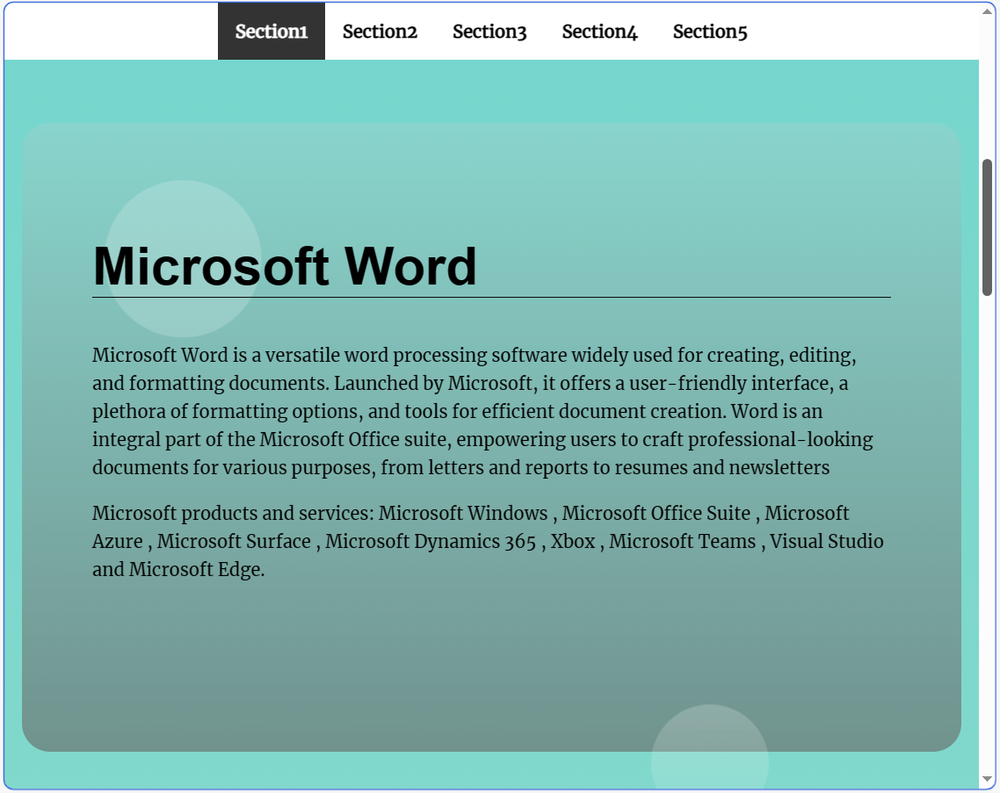

# Udacity | Landing Page Project

### In This Project We Are Converting A Static Landing Page Into A Dynamic One With The Help Of Javascript.

## Table of Contents:

-   [Project Title](#Udacity-|-Landing-Page-Project).

-   [Table of contents](#table-of-contents).

-   [Page Preview](#page-preview).

-   [Installation & Usage](#installation-and-usage).

-   [Development](#development).

-   [Contribute](#contribute).

-   [License & Copyright](#License-&-Copyright).

---

## Page Preview

---

[(Back to top)](#table-of-contents)

The project is ready as a ZIP file that you can download at any time.

Or clone it using `git clone.

After the Installation you can now use the project files by unzip the file then open it on any code editor e.g.(VS Code).

---

## Development

[(Back to top)](#table-of-contents).

>
>**_JS Version: ES2015/ES6._**
>
>**_JS Standard: ESlint_**
>

### **The Project Contains Four Files :**

#### *css /*

-   *styles.css*

#### *index.html*

#### *js /*

-   *app.js*

#### *README.md*

#### **Each file contains it's modifications and comment above each step of modify.**

-   In CSS Style, a lot of changes have been made to the project to be the style you see on the screen interface now, and a lot of modifications have been made to be responsive to all types of screens.

-   Not many modifications have been made to the HTML file, 5 sections have been added to the page.

-   Most of the work has been done on app.js, and there are a lot of things being done there:

 1. Use goToSection() method to scroll to anchor ID using scrollIntoView event.

          2. Build NavBar Using navBuilder() function that executed by foreach loop and other helping methods like createMenuLink() to create elements and insert text to it and also appending.

          3. Bulid scroll to up button using createUpButton() function to be easy for the user to click on it to go to the home page again without scrolling.

          4. use isInViewport() method to identify which section is on the viewport to help the isActive() method to give a special class to the sectoin and button in the NavBar to be clearly viewed to the user that this is the actual section he selected.

          5. Toggle the Navbar Visibility according to user interaction with a webpage by checking if he is scrolling or not using the setTimeOut Method.

---

# Contribute

[(Back to top)](#table-of-contents)

**- EgFWD**

**- ITIDA**

**- Udacity**

---

# License & Copyright

[(Back to top)](#table-of-contents)

_© Ahed Albalushi